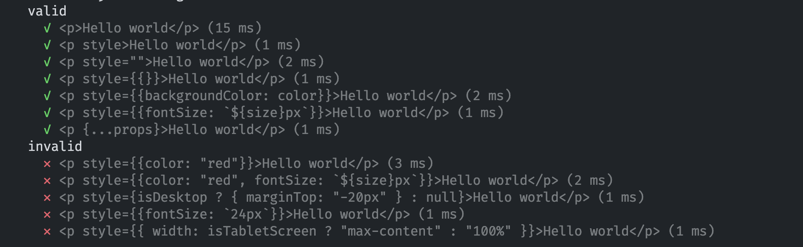

# eslint-plugin-jsx-no-inline-style

ESlint plugin to disallow inline styles in jsx.


<br/>



# Usage:

## Install

```
npm install eslint-plugin-jsx-no-inline-style
```

## Step 1: Add the plugin in ESLint Config

```json
{
	"plugins": ["jsx-no-inline-style"]
}
```

## Step 2: Add the Plugin's rule

```json
{
	"rules": {
		"jsx-no-inline-style/no-inline-style": "error"
	}
}
```

ESLint Plugin Guide:
https://www.alibabacloud.com/blog/write-eslint-rules-that-meet-needs_599280
